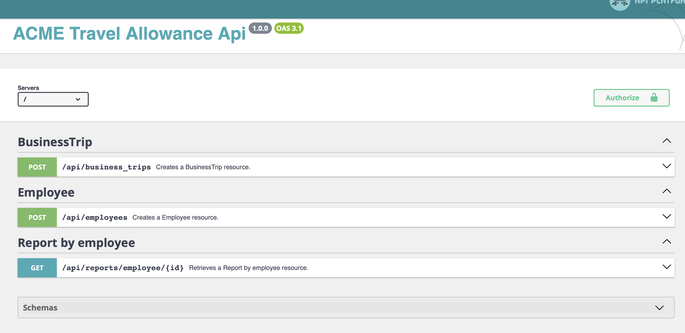

# Api

Aplikacja do kalkulacji diet.

## Uruchomienie z wykorzystaniem docker-a

```shell
$ docker build -t apitest:main https://github.com/lukaszbacik99/api.git#main
$ docker run --rm -p 127.0.0.1:8080:80 apitest:main
```

Po uruchomieniu kontenera jak powyżej api jest dostępne pod uri: http://localhost:8080/api 




Projekt korzysta z bazy sqlite - plik bazy jest tworzony automatycznie przy starcie kontenera, 
w lokalizacji: `var/data.db`

## Ogólnodostępna instancja

Instancja projektu jest dostępna pod adresem: https://apitest.dev.workshopapp.cloud/api

# Opis

## Write model

### Tworzenie pracownika

Endpoint: `POST /api/employees`

```shell
curl -X 'POST' \
  'https://apitest.dev.workshopapp.cloud/api/employees' \
  -H 'accept: application/json' \
  -H 'Content-Type: application/json' \
  -d '{}'
```

### Dodanie delegacji

Endpoint: `POST /api/business_trips`

```shell
curl -X 'POST' \
  'https://apitest.dev.workshopapp.cloud/api/business_trips' \
  -H 'accept: application/json' \
  -H 'Content-Type: application/json' \
  -d '{
  "employeeId": 1,
  "startDate": "2023-11-06 10:40",
  "endDate": "2023-11-08 12:00",
  "country": "PL"
}'
```

Wykorzystany model: https://github.com/lukaszbacik99/domain

### Odczytanie listy delegacji dla pracownika

Endpoint: `GET /api/reports/employee/{employeeId}`

```shell
curl -X 'GET' \
  'https://apitest.dev.workshopapp.cloud/api/reports/employee/1' \
  -H 'accept: application/json'
```

Prykładowy rezultat:
```json
[
  {
    "amount_due": 30,
    "currency": "PLN",
    "country": "PL",
    "start": "2023-11-06 10:40:11",
    "end": "2023-11-08 10:40:11"
  }
]
```

# Komentarz

## Testy

Api nie posiada testów - jedyne testy zostały dodane do modelu domenowego - https://github.com/lukaszbacik99/domain - 
https://github.com/lukaszbacik99/domain/tree/main/tests/TravelAllowance

W testach obliczeń jeden przypadek wymagałby chyba wyjaśnienia:

https://github.com/lukaszbacik99/domain/blob/7b5320c1bf3bc4440c1b58715d9270134356a712/tests/TravelAllowance/BusinessTrip/TravelAllowanceCalculatorTest.php#L74
```php
    [
        'countryCode' => 'PL',
        'startDate' => '2023-11-06 21:00',
        'endDate' => '2023-11-07 7:00',
        'expectedResult' => 0, // FIXME - should be 10 (?)
    ],
```

W żadnym z dni nie został spełniony warunek (>8h), ale sama delegacja jest dłuższa niż 8h - 
choć oczywiście, być może, to wcale nie wymaga korekty?

## Domena

Domena -  https://github.com/lukaszbacik99/domain - jest wykorzystywana tylko przy zapisie delegacji (write model) - 
zapis użytkownika (tworzenie nowego użytkownika) nie jest częścią tej domeny (ta operacja jest implementowana 
bezpośrednio przez framework).

Odczytanie danych jest elementem read modelu i - w tym przypadku - nie jest zaimplementowane w domenie. 

## Wyliczenia diet

Wyliczenia opisane są testem (dla różnych danych we):
https://github.com/lukaszbacik99/domain/blob/main/tests/TravelAllowance/BusinessTrip/TravelAllowanceCalculatorTest.php - 
mam nadzieję, że dobrze zrozumiałem założenia.

## Domena

### Konteksty ograniczone

Tak jak je rozumiem - można tutaj wyróżnić kontekst zapisu delegacji, ale wewnątrz niego rownież np. kontekst 
kalkulatora, czy kontekst kraju. 

### Hexagonal architecture

Mamy tutaj jedną zależność domeny ("port"): https://github.com/lukaszbacik99/domain/blob/main/src/TravelAllowance/BusinessTripRepositoryInterface.php.
Implementacja ("adapter") jest dostarczana przez aplikację (framework): https://github.com/lukaszbacik99/api/blob/main/src/Repository/BusinessTripRepository.php
